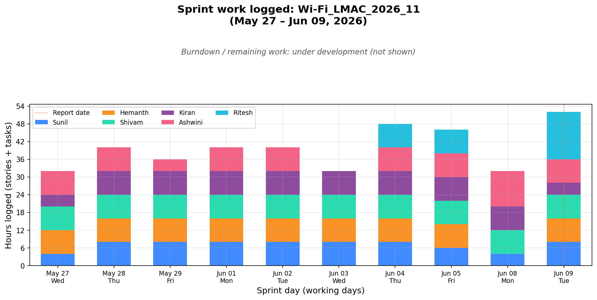

<p align="center">
  
</p>

# Sprint Report

A PySide6 desktop app for sprint leads: connect to Jira, pick a sprint, adjust team capacity, and generate a markdown report plus burndown chart — without hand-editing config files.

**Outputs**

- `sprint_report_<sprint>.md` — logged hours, KPIs, gaps, velocity, ticket snapshot  
- `sprint_burndown_<sprint>.png` — stacked daily hours by person  

---

## Proof

Real chart from sprint `Wi-Fi_LMAC_2026_11`:

<p align="center">
  
</p>

The Generate step previews both the report and this chart inline before you open the output folder.

---

<p align="center">
  
</p>

### What each step does

| Step | You do | App does |
|------|--------|----------|
| **1. Settings** | Enter Jira base URL + Personal Access Token (or username/password) | Saves credentials encrypted under your OS app-data folder; falls back to a `.env` next to the executable |
| **2. Sprint** | Search boards, pick a board and sprint, click *Load sprint* | Fetches issues + worklogs in the background |
| **3. Configure** | Tune weeks, meeting reserve, team include flags, leaves, exclusions, extras | Auto-populates assignees from the sprint; auto-saves per-sprint JSON; can import/export `sprint_report_config.md` |
| **4. Generate** | Click generate | Builds the report + burndown chart, previews both inline, opens the output folder |

---

<p align="center">
  
</p>

### Requirements

- Python **3.10+**
- Jira access (Personal Access Token recommended)
- Dependencies from `requirements.txt` and `requirements-gui.txt`

### Run from source

```bash
cd sprint_tools
pip install -r requirements.txt
pip install -r requirements-gui.txt
python -m gui.app
```

### Build a standalone executable

```powershell
pip install -r requirements.txt
pip install -r requirements-gui.txt
python build_exe.py
```

Output lands in `dist/` as `SprintReport.exe` (Windows) or `SprintReport` (macOS/Linux). No Python install needed on the target machine.

> Run `build_exe.py` on the OS you want to target — PyInstaller does not cross-compile.

### First-run checklist

1. Open the app → **Settings** → set Jira URL + PAT → Save  
2. **Sprint** → search your board → pick the sprint → *Load sprint*  
3. **Configure** → set **report date**, uncheck managers, add leaves / exclusions if needed  
4. **Generate** → preview report + chart → open the output folder  

---

## Where files are stored

| Path | Purpose |
|------|---------|
| `%APPDATA%\SprintReport\settings.json` | Jira creds (token encrypted), prefs |
| `%APPDATA%\SprintReport\configs\<sprint>.json` | Per-sprint UI config |
| `%APPDATA%\SprintReport\output\sprint_report_<sprint>.md` | Generated report (default) |
| `%APPDATA%\SprintReport\output\sprint_burndown_<sprint>.png` | Generated chart (default) |
| `%APPDATA%\SprintReport\logs\` | Session / crash logs |

On Linux use `~/.config/SprintReport/…`. On macOS use `~/Library/Application Support/SprintReport/…`.

---

## What the report contains

1. **Logged Hours by Person** — stories and tasks, weekday tables  
2. **Sprint KPI Summary** — completion, velocity, churn, ticket counts  
3. **Daily Log Gaps** — days with no logged work  
4. **Sub-task Validation** — remaining work / worklogs on sub-tasks  
5. **Sprint Completion & Velocity** — per-person breakdown  
6. **Sprint Tickets** — status and remaining work  
7. **Burndown Chart** — stacked daily logged hours  

---

## Configure screen (what you can edit)

| Area | Purpose |
|------|---------|
| Sprint name / duration / report date | Identity and worklog cut-off (see below) |
| Meeting / ceremony reserve | Days deducted from each person's capacity |
| Team members | Include/exclude people (assignees pre-filled) |
| Planned leaves | Leave days per person (name must match team list) |
| Other exclusions | Non-dev hours (support, mentoring, …) |
| Extra tickets | Tickets outside the sprint to still track |
| Excluded tickets | In-sprint tickets to ignore (umbrellas, duplicates) |
| Report options | Per-ticket worklog detail on/off |

Configs reload automatically the next time you open the same sprint.

### Report date (important)

The report and burndown only include worklogs **up to and including the report date**. Anything logged after that date is ignored.

- Set the date deliberately before you generate (for example today for a mid-sprint snapshot, or the sprint end date for a final report).
- If the date is wrong, hours, gaps, KPIs, and the chart will all be truncated or incomplete.

### Planned leaves (name matching)

Leave rows are matched to people by **name**. The name must match a row in **Team members** exactly (same spelling and spacing as shown in that list).

- Prefer picking the name from the dropdown when the UI offers one.
- If the name does not match, that leave is **not applied** — capacity stays full for that person and the report will look wrong.

---

## App layout

```
gui/
├── app.py                 # Entry: python -m gui.app
├── main_window.py         # Four-step navigation
├── settings.py            # Encrypted creds + app-data paths
├── pages/
│   ├── settings_page.py
│   ├── sprint_select_page.py
│   ├── config_page.py
│   └── generate_page.py
└── workers/               # Background Jira fetch
build_exe.py               # → dist/SprintReport*
```

---

## Troubleshooting

| Issue | Fix |
|-------|-----|
| App asks for credentials every time | Save on the Settings page; confirm write access to the app-data folder |
| Sprint list empty / load fails | Check Jira URL + PAT on Settings; confirm board search text matches |
| Empty burndown | Confirm included teammates have worklogs in the sprint date range |
| `ModuleNotFoundError: PySide6` | `pip install -r requirements-gui.txt` |
| Exe build fails on another OS | Build on the target OS; PyInstaller is not cross-platform |
| Unexpected crash | Check `%APPDATA%\SprintReport\logs\` (or `~/.config/SprintReport/logs/` on Linux) |

---

## License / internal use

Internal tooling for sprint reporting against Jira. Keep PATs out of git — the app encrypts tokens in local settings (and can fall back to a local `.env` next to the executable).
