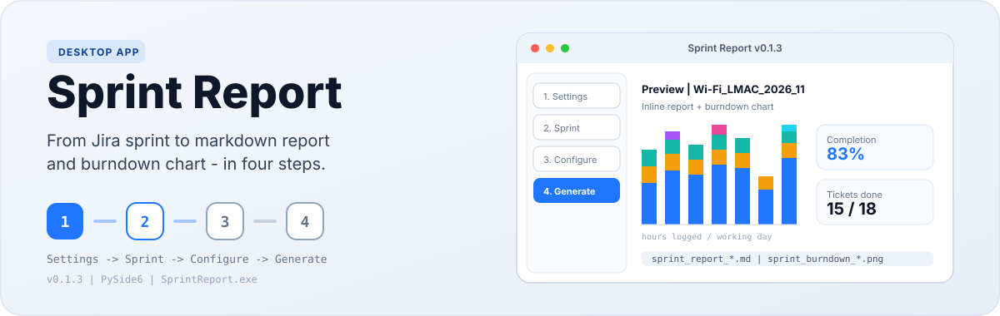
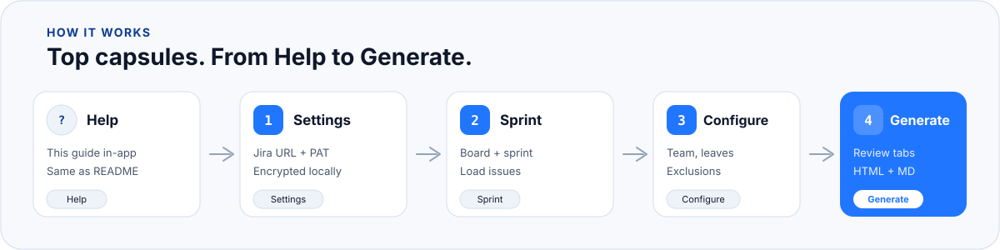
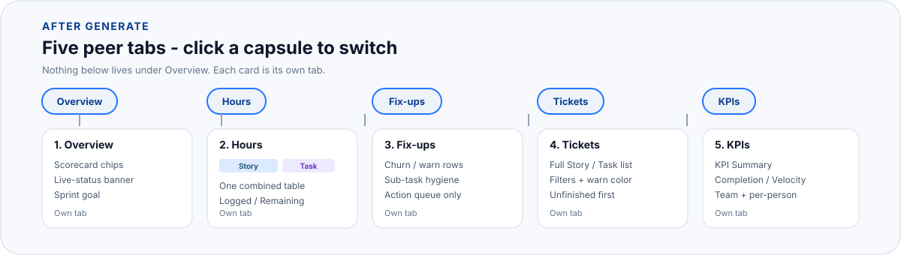
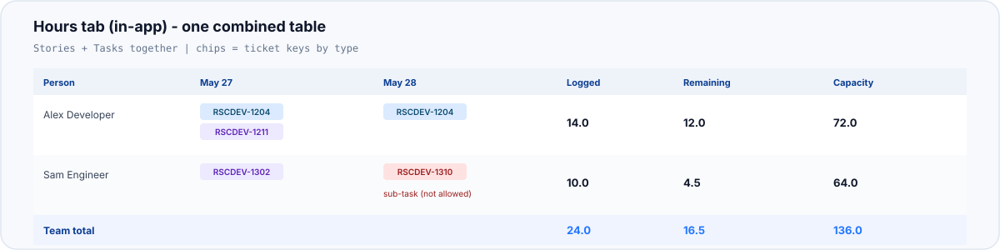
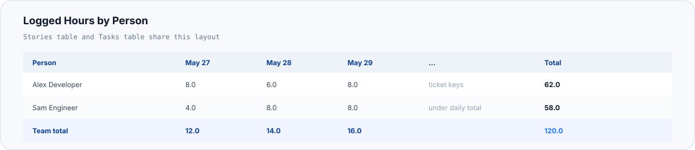
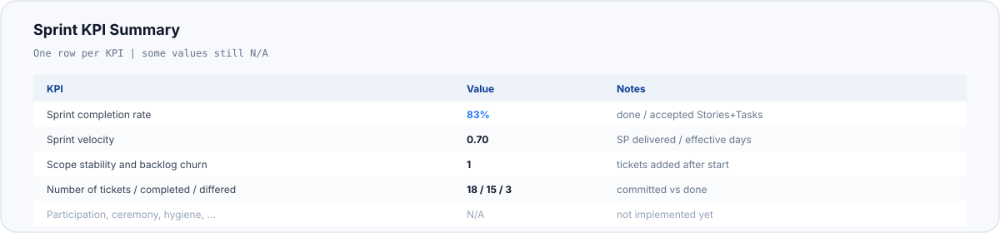
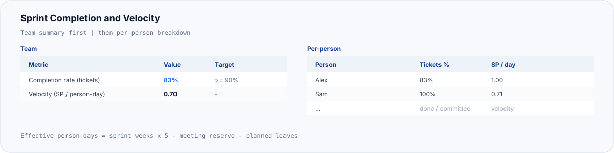
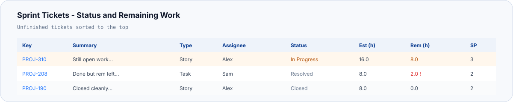
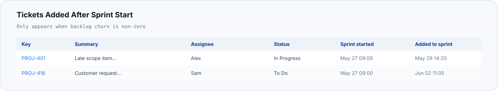
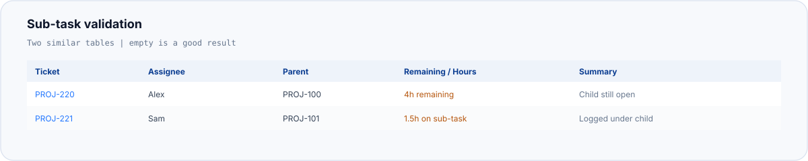

  

# Sprint Report

Desktop app for sprint leads. This Help page is about **using the app** (top capsules → Generate review).  
Sharing uses exported HTML/Markdown — that file layout is summarized at the end (it is **not** a 1:1 mirror of the in-app tabs).

**Outputs after Generate**

| File | What it is |
|------|------------|
| `sprint_report_<sprint>.html` | Styled report for sharing / browser |
| `sprint_report_<sprint>.md` | Portable markdown of the same tables |

---

  

  

## 1. Top capsules (app shell)

| Capsule | You do | App does |
|---------|--------|----------|
| **Help** | Read this guide | Shows this page |
| **Settings** | Jira URL + PAT (or username/password) | Saves credentials encrypted locally |
| **Sprint** | Pick board + sprint → *Load sprint* | Fetches issues + worklogs |
| **Configure** | Report date, team, leaves, exclusions | Saves config per sprint / board roster |
| **Generate** | Click *Generate*, then use review capsules | Builds HTML + MD and opens the review UI |

### Checklist

1. **Settings** → URL + PAT → Save  
2. **Sprint** → load sprint  
3. **Configure** → report date, people, leaves  
4. **Generate** → review → open HTML / folder  

### Configure tips

**Report date** — worklogs only **up to and including** this date. Wrong date truncates hours and KPIs.

**Planned leaves** — person name must match a **Team members** row exactly (use the dropdown).

**Include** — only included people appear in Hours / completion. Worklogs match **Jira author** name.

**Team roster** — saved per board; people on full leave with no tickets still reappear on the next load.

**Excluded tickets** — omitted from KPIs, completion, and Tickets.

---

## 2. After Generate — in-app review (five capsules)

These are **separate tabs**. Click a capsule to switch; only that tab’s content is shown.

  

| Capsule | What you see in the app |
|---------|-------------------------|
| **Overview** | Scorecard chips (completion, velocity, open, churn, remaining, capacity), live-status banner, full sprint goal |
| **Hours** | **One** combined person × day table (Stories + Tasks together). Day cells show **ticket-key chips** (blue Story / purple Task / red Sub-task). Columns: Logged, Remaining, Capacity. Click a day for hours in the drawer |
| **Fix-ups** | Action list only: churn, ⚠ done-with-remaining, sub-task remaining, sub-task worklogs |
| **Tickets** | Full Story/Task list with filters (Status, Assignee, Type, ⚠). Unfinished first; ⚠ rows highlighted |
| **KPIs** | Sprint KPI Summary + Completion & Velocity (team + per-person) — same numbers SMs use from the export |

**Default after Generate:** Fix-ups if anything needs cleanup, otherwise Overview.

### Hours tab (in-app) — one table

Unlike the exported file (which has separate Stories and Tasks hours sections), the app **Hours** tab is a **single combined matrix**.

  

---

  

## 3. Exported HTML / Markdown (sharing only)

Open these in a browser or editor to share. Layout differs from the in-app tabs:

| Export section | Closest in-app tab |
|----------------|--------------------|
| Stories hours table + Tasks hours table | **Hours** (combined into one tab) |
| Sprint KPI Summary + Completion & Velocity | **KPIs** |
| Tickets added after start + sub-task validations | **Fix-ups** |
| Sprint Tickets status & remaining | **Tickets** |
| Opening scorecard / goal | **Overview** |

### Export hours (two tables)

The file still has **Stories — logged hours** and **Tasks — logged hours** as separate tables (Person → weekdays → Logged → Remaining). Sub-task worklogs are excluded from those totals.

  

### Export KPI Summary

Columns: KPI | Value | Notes (completion, velocity, churn, ticket counts; some rows still `N/A`).

  

### Export Completion & Velocity

Team metrics + per-person SP/tickets. Done = Done/Complete category **or** Resolved.

  

### Export tickets & hygiene

- **Tickets added after sprint start** (when churn &gt; 0)  
- **Sub-tasks with remaining** / **work logged on sub-tasks**  
- **Sprint Tickets** list with ⚠ when done/Resolved but Remaining &gt; 0  

  

  

  

### Inclusion rules

| Rule | Effect |
|------|--------|
| Include = Yes | Person in Hours / completion |
| Worklog author name | Must match team member name |
| Excluded tickets | Omitted from KPIs / completion / Tickets |
| Report date | Caps weekday columns and validation window |
| Sub-tasks | Export hours/completion omit them; app shows them on Hours chips + Fix-ups |
